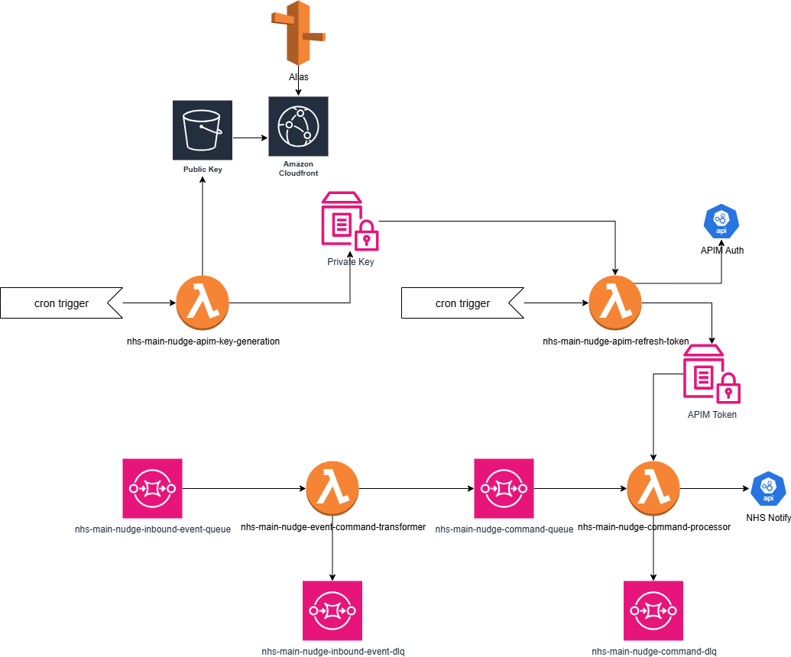

# NHS Notify SMS Nudge

[](https://github.com/NHSDigital/nhs-notify-sms-nudge/actions/workflows/cicd-1-pull-request.yaml)

This repository contains the infrastructure and code required to transform NHS App 'Unnotified' callbacks into SMS Nudges if delayed fallback is enabled.

## Table of Contents

- [NHS Notify SMS Nudge](#nhs-notify-sms-nudge)
  - [Table of Contents](#table-of-contents)
  - [Setup](#setup)
    - [Prerequisites](#prerequisites)
    - [Configuration](#configuration)
  - [Usage](#usage)
    - [Testing](#testing)
  - [Design](#design)
    - [Diagrams](#diagrams)
  - [Contributing](#contributing)
  - [Contacts](#contacts)
  - [Licence](#licence)

## Setup

Clone the repository

```shell
git clone https://github.com/NHSDigital/nhs-notify-sms-nudge.git
cd nhs-notify-sms-nudge
```

### Prerequisites

The following software packages, or their equivalents, are expected to be installed and configured:

- [asdf](https://asdf-vm.com/) version manager,
- [GNU make](https://www.gnu.org/software/make/) 3.82 or later,

> [!NOTE]<br>
> The version of GNU make available by default on macOS is earlier than 3.82. You will need to upgrade it or certain `make` tasks will fail. On macOS, you will need [Homebrew](https://brew.sh/) installed, then to install `make`, like so:
>
> ```shell
> brew install make
> ```
>
> You will then see instructions to fix your [`$PATH`](https://github.com/nhs-england-tools/dotfiles/blob/main/dot_path.tmpl) variable to make the newly installed version available. If you are using [dotfiles](https://github.com/nhs-england-tools/dotfiles), this is all done for you.

- [GNU sed](https://www.gnu.org/software/sed/) and [GNU grep](https://www.gnu.org/software/grep/) are required for the scripted command-line output processing,
- [GNU coreutils](https://www.gnu.org/software/coreutils/) and [GNU binutils](https://www.gnu.org/software/binutils/) may be required to build dependencies like Python, which may need to be compiled during installation,

> [!NOTE]<br>
> For macOS users, installation of the GNU toolchain has been scripted and automated as part of the `dotfiles` project. Please see this [script](https://github.com/nhs-england-tools/dotfiles/blob/main/assets/20-install-base-packages.macos.sh) for details.

- [Python](https://www.python.org/) required to run Git hooks,
- [`jq`](https://jqlang.github.io/jq/) a lightweight and flexible command-line JSON processor.

### Configuration

Installation and configuration of the toolchain dependencies

```shell
make config
```

## Usage

The functionality can be tested once deployed to AWS by sending a manual message to the queue nhs-main-nudge-inbound-event-queue. Here is an example

```json
{
  "version": "0",
  "id": "29f7c21a-c972-9246-32cb-61c5c005125b",
  "detail-type": "uk.nhs.notify.channels.nhsapp.SupplierStatusChange.v1",
  "source": "custom.event",
  "account": "257995483745",
  "time": "2025-07-30T09:57:58Z",
  "region": "eu-west-2",
  "resources": [],
  "detail": {
    "id": "95e5a43f-71e8-46d2-abd1-ea60069e5204",
    "source": "//nhs.notify.uk/supplier-status/internal-dev",
    "specversion": "1.0",
    "type": "uk.nhs.notify.channels.nhsapp.SupplierStatusChange.v1",
    "plane": "data",
    "subject": "30ad5WsumjRJR0YYL7U34UKne4U",
    "time": "2025-07-30T09:57:57.027Z",
    "datacontenttype": "application/json",
    "dataschema": "https://notify.nhs.uk/events/schemas/supplier-status/v1.json",
    "dataschemaversion": "1.0.0",
    "data": {
      "nhsNumber": "9999999786",
      "delayedFallback": true,
      "sendingGroupId": "66bad261-2754-4f4a-89bb-777502106cc6",
      "clientId": "apim_integration_test_client_id",
      "supplierStatus": "unnotified",
      "previousSupplierStatus": "received",
      "requestItemId": "30ad4AdMGk8qHecaXGpc7oR94Xv",
      "requestItemPlanId": "30ad5WsumjRJR0YYL7U34UKne4U"
    }
  }
}
```

### Testing

There are `make` tasks for you to configure to run your tests. Run `make test` to see how they work. You should be able to use the same entry points for local development as in your CI pipeline.

## Design

### Diagrams

The [C4 model](https://c4model.com/) is a simple and intuitive way to create software architecture diagrams that are clear, consistent, scalable and most importantly collaborative. This should result in documenting all the system interfaces, external dependencies and integration points.



Main components:

- Transformer lambda: filters outs event that should be transformed into SMS Nudge commands
- Command lambda: sends SMS Nudges to the NHS Notify API
- Key generation lambda: generates a private key if there is a valid one and uploads the corresponding public key to an S3 bucket to expose it to APIM
- Token generation lambda: uses the private key generated above and an API key to generate an authorisation token that is then stored in SSM. That token is then used to send requests to the NHS Notify API

## Contributing

--

## Contacts

NHS Notify Team

## Licence

--
